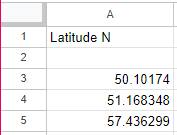
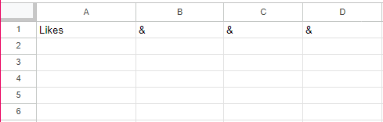
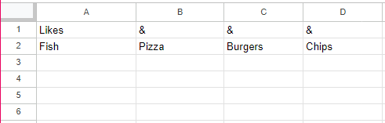
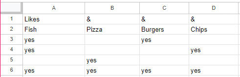

# University of Exeter Map Embed

## Dataset Specification

This embed uses a CSV or Google sheet as its dataset. The sheet must obey a few rules for it to work.
Firstly, the google sheet **must** contain a single sheet, rather than having multiple sheets across multiple tabs.
There are firstly two types of column that this embed uses. The first type is just a basic column, where all the values appear in the dataset unchanged. Then the next type of column is a multi-value column, where you specify a few possible values that the column has, and then each row in the dataset will specify whether it contains that value, or not.

Firstly the sheet must have 2 header rows, where the very top row contains column headers/special flags.

To make a basic column, put the name of the column on the first row, and then the row directly below that should be empty. For example:



To make a multi-value column, there's a few things you need to do:

1. Have the column heading in the first row in the sheet, on the furthest left column in the sheet where the multi-value column will start
2. Figure out how many unique values this column can have and add columns to the right of the header column for as many unique values you have, header column included. E.g. if I had a `Likes` column, which could be `Fish`, `Pizza`, `Burgers`, and `Chips` I would have 4 columns total, with `Likes` in the first column heading.
3. Fill in the rest of the column headings on the first row in the sheet with `&`. So for example, I should now have something looking like this: 
4. On second row, fill in each of the unique values across the entire row. Order doesn't matter, just as long as you're consistent. Keeping with the example, it now looks like this: 
5. Time to fill in your values, where in each of the rows below, if the row contains the unique value in the second heading row, then put `yes` in the cell, otherwise leave it blank. The full working example now looks like this: 

## Creating A Dataset Config

Dataset configs are written using both [YAML][yaml] as well as [Markdown][markdown], where the [YAML][yaml] will appear as front-matter in the [markdown][markdown] config file.

I would recommend putting your configuration on github, in a repository. Use this guide on [how to create a github repository](https://docs.github.com/en/get-started/quickstart/create-a-repo).

An example config template:

```text
---
title: Embed title
blurb: A blurb appearing right below the title, capable of having _**rich text formatting**_
latitude: LAT_COLUMN_HEADER
longitude: LON_COLUMN_HEADER
shortDescription: DESC_COLUMN_HEADER
filters:
  A_COLUMN_HEADER: Radio_on
  B_COLUMN_HEADER: Radio_off
  C_COLUMN_HEADER: Standard
---

##### {{TITLE_COLUMN_HEADER}}

---

{{SUMMARY_COLUMN_HEADER}}

[View online]({{HYPERLINK_COLUMN_HEADER}})
```

Firstly, there are landmarks in this file, where the first line with the `---`, must be within any config file. Similarly, there's a next set of `---` which signifies the end of the [YAML][yaml] config (There is a third set as well, however that's part of the [markdown][markdown] and means a horizontal line separator, more on this below).

After that will come the [Markdown][markdown] which specifies how to render the preview of the publication (more on this below).

## [YAML][yaml] Specification

To learn how [YAML][yaml] works, you can have a look at [https://learnxinyminutes.com/docs/yaml/](https://learnxinyminutes.com/docs/yaml/).
This isn't necessary, however, as you should be able to use the above template, as well as using the instructions below.

### Title And Blurb

These are optional and can be anything you like, where the title will appear at the top of the embed, and then the blurb appearing right below the title.
The blurb can also use [Markdown][markdown] for rich text formatting.

### Latitude, Longitude, And Short Description

These lines in the [YAML][yaml] specification, should be set to the headers of the corresponding columns in your dataset.

### Filters

Filters are what appear on the sidebar menu, where they can either be one of two types: a `Radio` filter, or a `Standard` filter.

Standard filters are useful for cases where publications can have multiple values for a column. This is because they let you select multiple values at once, and then decide whether the results must contain some of the selected options, or if they must contain every single selected option.

Radio filters are effectively the same as a standard filter, however they have a radio button on the filter title. This controls all the options, where if you turn it on, then all of the options will also turn on, and turning it off will also turn all the options off.
Radio filters will also be options in the publication heatmap.
These radio filters can have their initial value being _on_, or _off_ which is set by putting `Radio_on` for an on initial state, or `Radio_off` for an off initial state.

As the template has, filters are defined with the column header you want to filter with and the filter type, like so:

```yaml
filters:
  A_COLUMN_HEADER: Radio_on
  B_COLUMN_HEADER: Radio_off
  C_COLUMN_HEADER: Standard
```

You can also have as many filters as you like.

## Markdown Publication Preview Specification

In the template, after the [YAML][yaml] there's some [markdown][markdown] text. If you don't know how [markdown][markdown] works, then refer to this guide: [https://commonmark.org/help/][markdown], or for more advanced usage, use: [https://spec.commonmark.org/0.30/](https://spec.commonmark.org/0.30/).

There are also some bits in the [markdown][markdown] which are like so: `{{ some_column_header }}`. This will insert the corresponding value in the `some_column_header` column from the selected publication.

## Embed Setup

Firstly, place an iframe in your HTML, where you'd like the embed to go. Then also add the following script tag:

```html
<script src="<EMBED_URL>/embed.js"></script>
```

Where you should replace `<EMBED_URL>` with the link to the embed.

### Iframe Data Attributes

There are some required and some conditional data attributes. These are:

- Required:
  - `data-map-embed`: Contains the link to the embed itself
  - `data-config`: Contains the URL of the dataset config [markdown][markdown] file
  - `data-mapbox-token`: Contains the public token for mapbox
- Optional:
  - `additional-css`: A link to any additional CSS you would like to apply to the embed. This allows you to create a unique looking embed
- Then there's also attributes which will configure the source, where you must include one source
  - Google sheets source:
    - `data-google-sheet`: Contains the google sheet ID (to find this, refer to the below)
  - Custom CSV source:
    - `data-csv`: Contains the URL of the raw CSV itself

To find the google sheets attribute values, use:

```text
https://docs.google.com/spreadsheets/d/XXXXXXXXXXXXXXXXXXXXXXXXXXXXXXXXXXXXXXXXXXXX/edit#gid=0123456789
                                       ^^^^^^^^^^^^^^^^^^^^^^^^^^^^^^^^^^^^^^^^^^^^
                                       [data-google-sheet]
```

Once you've done the above, the iframe tag should look something like this:

```html
<iframe
  title="Map Embed"
  data-map-embed="https://map-embed.com/"
  data-config="./dataset-config.md"
  data-mapbox-token="pk.XXXXXXXXXXXXXXXXXXXXXXXXXXXXXXXXXXXXXXXXXXXXXXXXXXXXXXXXXXXXXXXXXXXXXXXX.XXXXXXXXXXXXXXXXXXXX-w"
  additional-css="./myStyles.css"
  data-google-sheet="XXXXXXXXXXXXXXXXXXXXXXXXXXXXXXXXXXXXXXXXXXXX"
></iframe>
```

## Developer Information

This project was bootstrapped with [Create React App](https://github.com/facebook/create-react-app).

### Installation

This repository uses Node version `v19.2.0`. Once you have this installed, make sure you also install `yarn` globally, with

```properties
npm install yarn -G
```

Once you have this installed, run

```properties
yarn
```

This will install the needed dependencies.

### Available Scripts

In the project directory, you can run:

#### `yarn start`

Runs the app in development mode.\
Open [http://localhost:3000](http://localhost:3000) to view it in the browser.

The page will reload if you make edits.\
You will also see any lint errors in the console.

#### `yarn test`

Launches the test runner in the interactive watch mode.\
See the section about [running tests](https://facebook.github.io/create-react-app/docs/running-tests) for more information.

#### `yarn build`

Builds the app for production to the `build` folder.\
It correctly bundles React in production mode and optimizes the build for the best performance.

The build is minified and the filenames include the hashes.\
Your app is ready to be deployed!

See the section about [deployment](https://facebook.github.io/create-react-app/docs/deployment) for more information.

#### `yarn eject`

**Note: this is a one-way operation. Once you `eject`, you can’t go back!**

If you aren’t satisfied with the build tool and configuration choices, you can `eject` at any time. This command will remove the single build dependency from your project.

Instead, it will copy all the configuration files and the transitive dependencies (webpack, Babel, ESLint, etc) right into your project so you have full control over them. All of the commands except `eject` will still work, but they will point to the copied scripts so you can tweak them. At this point you’re on your own.

You don’t have to ever use `eject`. The curated feature set is suitable for small and middle deployments, and you shouldn’t feel obligated to use this feature. However we understand that this tool wouldn’t be useful if you couldn’t customize it when you are ready for it.

#### `yarn findissues`

This command will run typescript's type checker, as well as lint using eslint.

## Glossary

| Term                 | Definition                                                               |
| -------------------- | ------------------------------------------------------------------------ |
| Config               | A set of settings, or configurations meaning to customize to your liking |
| [Markdown][markdown] | A way to produce some formatted text and have basic control over layout  |
| [YAML][yaml]         | A Configuration format                                                   |

[markdown]: https://commonmark.org/help/
[yaml]: https://learnxinyminutes.com/docs/yaml/
